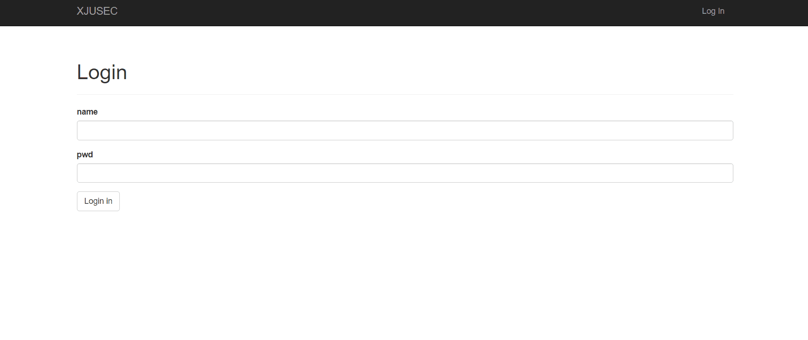
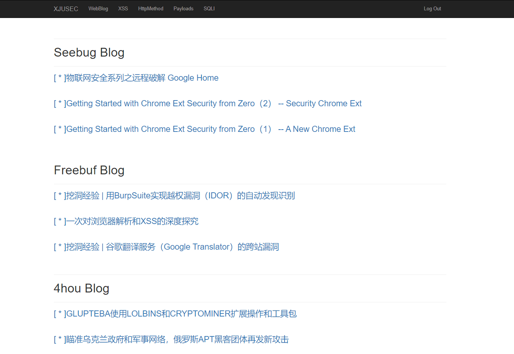
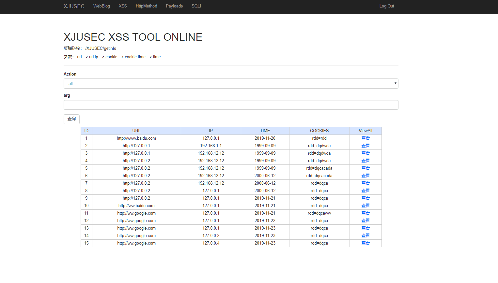
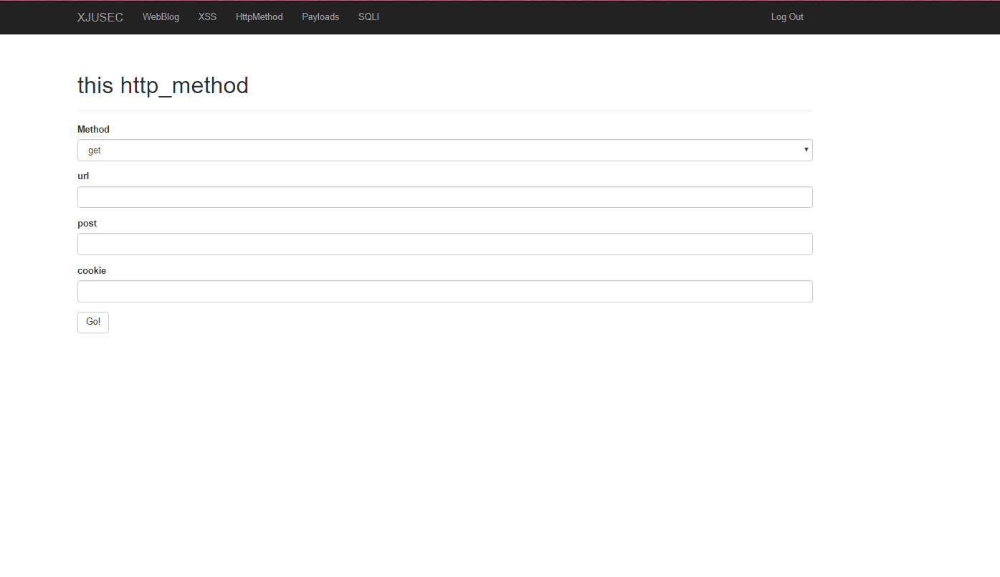
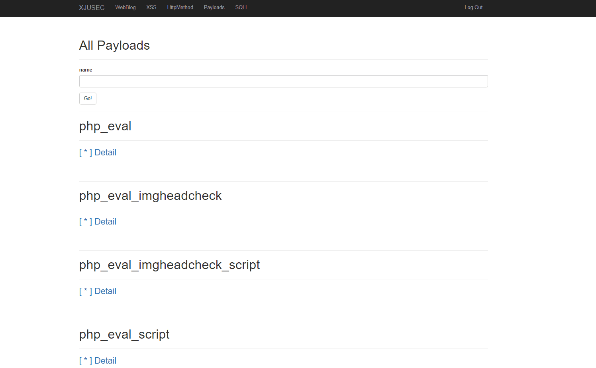

# XJUSEC Tools by RDD

---

##0.0

    Version：0.1
    Time：2020-01-29
    Author：RDD @ XJUSEC(新疆大学网络安全协会)

---

##README

    0x00：这是我学习flask框架的练习作品，仅供学习；
    0x01：主要功能有汇总各个平台和师傅的文章，接收XSS反射，http请求跳板，存储各种常用payload；
    0x02：待完善功能有在特殊情况下转发sqli的payload和awd平台的部署（套用开源awd平台并接入这个平台里）
    0x03：代码太乱了，日后会慢慢整理，刚开始做时没想到要做这么多功能，这也吃了没计划的亏；
---

##config
    
    Python3.7
    Flask
    Mysql5.0.96
    Windows Or Linux

---

##Run 
    
    cd xjusec
    pip install -r req.txt
    sql 
	flask run

##Login
    
    username : admin_rdd
    password : rddhero

---

##Appliaction

###Blog
    
    0.0：仅web安全相关；
    new blog：查看数据库中最新的博客；
    all blog：查看历史以来爬取所有的博客；
    upload blog：爬取最新的博客并写入数据库；
    ps：相关的博客爬虫需要自己开发，且需要更新；

    缺陷：数据库操作不成熟，偶尔出现bug；

###XSS

    0.0：提供了接收数据的接口有url，ip，cookie；可以进行拓展；
    0.1：提供了多种查询方式 
    0.2：反弹链接是 http://ip:port/XJUSEC/getinfo

   

###Http

    可以进行GET和POST请求，个人觉得不是什么重要的功能；

###Paylaods

    存储了测试用的payload，paylaod存储在./payload，写入文件后会更新，可以进行查询筛选；下个版本可以提供写入paylaod的功能

